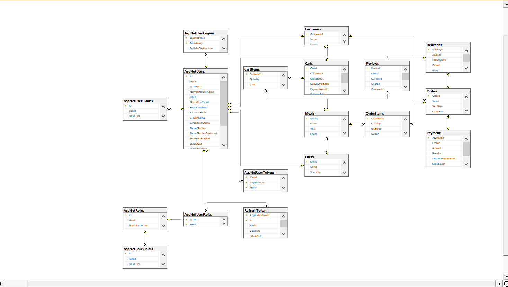
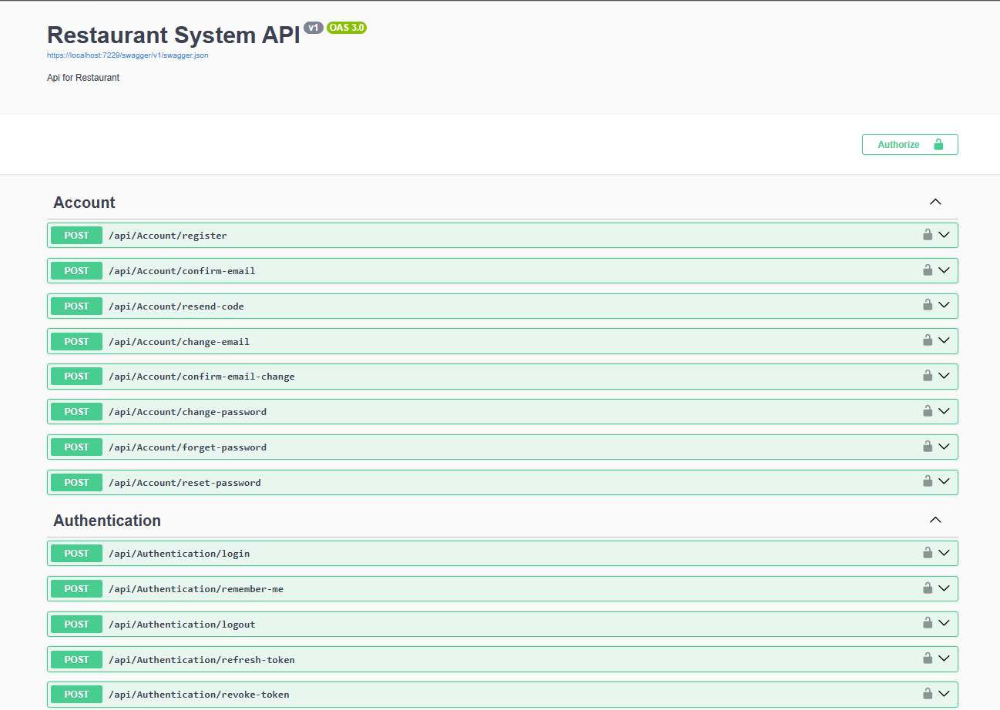
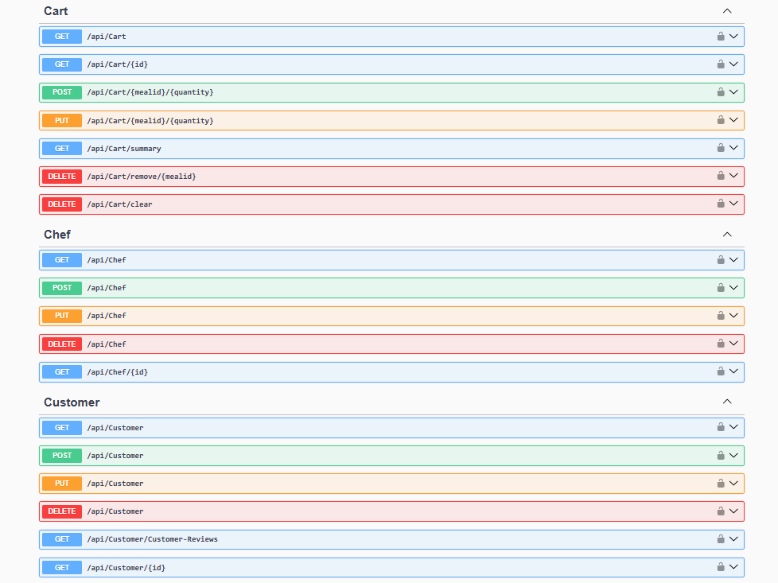
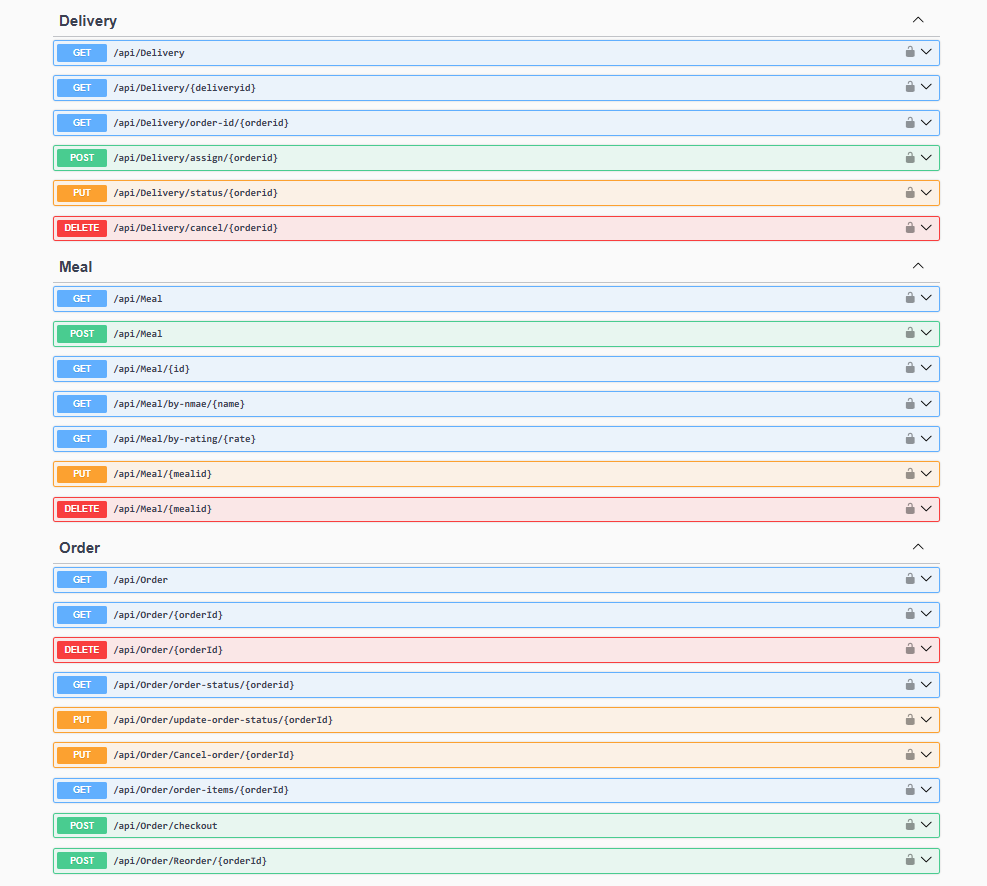

# 🍽️ Restaurant System API

A full-featured Restaurant Management System built using ASP.NET Core with Clean Architecture.

---

## 🚀 Features

- Authentication & Authorization (JWT + Refresh Token)
- Account Management (Register, Confirm Email, Reset Password)
- Cart System
- Orders
- Payment Integration (Stripe)
- Delivery Tracking
- Reviews System
- Chef
- Role
- Clean Architecture Pattern

---

## 🏗️ Technologies Used

- ASP.NET Core Web API
- Entity Framework Core
- SQL Server
- JWT Authentication
- Stripe Payment
- Clean Architecture
- Repository & Unit of Work Pattern

---

### 📌 Overview

- Built a scalable RESTful API using ASP.NET Core 8 and Clean Architecture.
- Implemented Generic Repository, Unit of Work Pattern.
- Secured API with JWT authentication & authorization using ASP.NET Core Identity.
- Designed and implemented secure account management workflows including email verification,
  resend confirmation codes, email change validation, and password reset functionality.
- Implemented JWT Refresh Tokens & Revoke Token.
- Integrated Stripe for payment processing.
- Implemented Localization & Globalization (multi-language and culture support).
- Full Role & Permission Management (Admin, Customer, Chef, Delivery).
- Using AutoMapper integrated for mapping between entities & DTOs

---

## 📸 Project Screenshots

### 🗄 Database

---

### 🔐 Account & Authentication

---

### 👨‍🍳 Cart & Chef & Customer

---

### 🚚 Delivery & Meal & Order

---

### 💳 Payment & Review & Role

---

